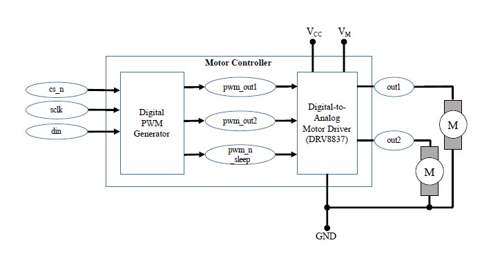
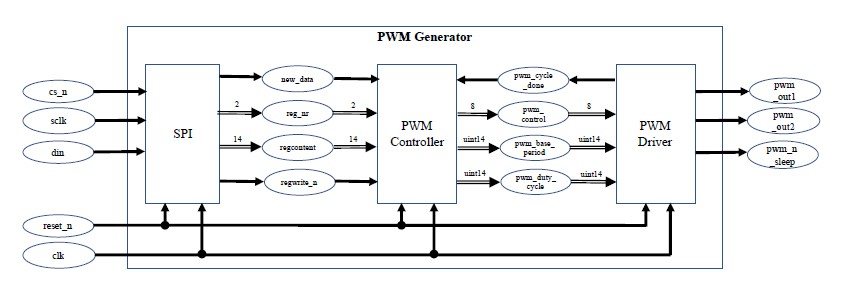
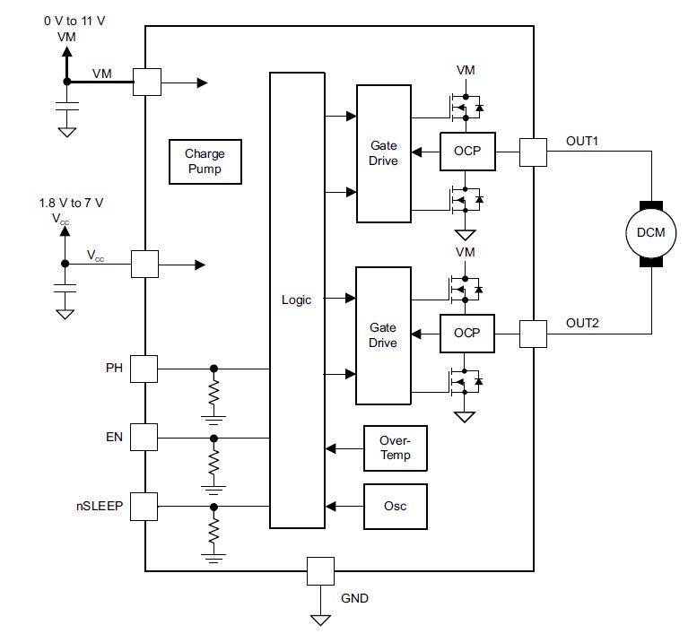
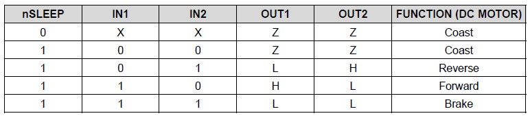

This repository is the design of Motor controller that consists of a digital top level component called "Digital PWM generator" and an analogue "Digital-to-Analog Motor Driver". The digital part generates the PWM signals based on the given inputs from SPI. In the analog part, the digital PWM is converted to an electric signal that models the motor driver(DRV8837 of Texas Instruments) current and voltage. These output signals will drive one or motor connected motors. 

The digital part is designed using VHDL
The analog part is designed using VHDL-AMS

The schematic of top level view of Motor controller is shown below.

Digital part design
--------------------
The digital design is further subdivided into 3 components.

1. Serial Parallel Interface
2. PWM controller
3. PWM driver and PWM Generator

The schematic of the PWM generator is represented below.

Serial Parallel Interface (SPI)
-------------------------------
This design realises the conversion of serial SPI communication to a parallel access register content to the following PWM controller. This component acts as slave. It consists of 17 cycles, first two indicate the address to which data needs to be sent, third indicates read/write access and remaining 14 cycles are actual data which is transferred to the register selected in the first 2 bits.

A finite state machine is designed with the states for start of new cycle, to fetch data, write data to output and end SPI operation. These states are clocked with the main system clock(100MHz). The access to the SPI interface is synchronized with the SPI clock(5 MHz). 

PWM controller
--------------
This design receives the input from the SPI regcontent bitstream and convert it into base period, duty cycle and pwm control when the values of the reg_nr are 01,10 and 11 respectively. 

PWM driver and generator
------------------------
This design consists of the design of PWM driver that gets value from the PWM controller and generates appropriate PWM signals at its output. 

The ouput of the PWM driver is controlled by the input from the PWM controller where 

bit position |	operation	| output
-------------|------------------|-----------------------------------------
0	     |	enable		| 1- enable output, 0- disable output
1	     |	motor direction	| 1- inverted output, 0- same behaviour
2	     |	brake		| 1- brake, 0- normal operation

Finally a top level design connects the SPI, PWM controller and PWM driver completes the PWM generator design. 

Analog part design
------------------
The Analog/Mixed signal part of motor controller is represented by a simplified model of TI DRV 8837 chip. It contains the conversion logic an driver circuit.

MOSFETs are used as switchable resistors.
The diodes have following parameters.
	- Thermal voltage 25mV
	- Saturation current 1nA
	- Ideality factor 1.1

The switching logic for the DRV 8837 is as below

Finally, both the analog and digital part of the design is integrated into the top level design of motor controller.

